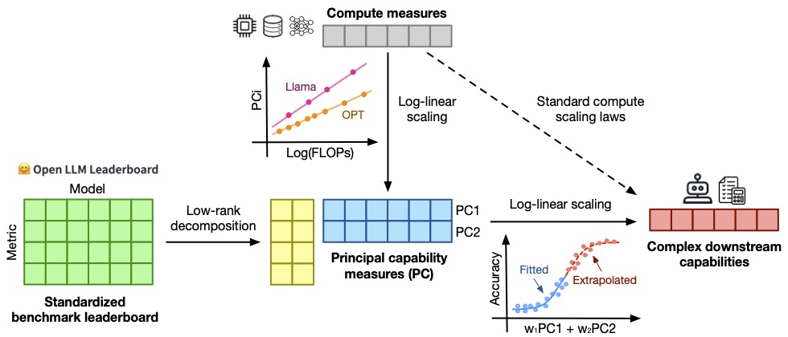

# Observational Scaling Laws


<!-- <div align="center" style="font-size: 28px;">
    [<a href="https://arxiv.org/abs/2405.10938">📃 Paper</a>] &nbsp;&nbsp;&nbsp;
    [<a href="https://x.com/YangjunR/status/1793681226349563954">🐦 Twitter</a>]
</div>

<br> -->

This repo contains the code for the paper [Observational Scaling Laws and the Predictability of Language Model Performance](https://arxiv.org/abs/2405.10938).

<div align="center">
  
</div>

<br>

Observational scaling laws generalize scaling laws by identifying a low-dimensional capability measure extracted from standard LLM benchmarks (e.g., [Open LLM Leaderboard](https://huggingface.co/spaces/open-llm-leaderboard/open_llm_leaderboard)) as a surrogate "scale" measure to analyze the scaling of complex LM downstream phenomena (e.g., agentic or "emergent" capabilities). 
The low-dimensional capability measure serves as a shared axis for comparing model families trained with different recipes (e.g., Llama-2, Phi, StarCoder, etc) and log-linearly correlates with compute measures (e.g., training FLOPs) within each model family, allowing us to utilize hundreds of public LMs for a training-free, high-resolution, and broad-coverage scaling analysis.

We release:
- Collected metadata and evaluation results for nearly 100 public pretrained models and instruction-tuned models
- Code for fitting observational scaling laws for scaling analyses
- Code and guidelines for selecting representative model subsets for low-cost scaling analyses

## Guidelines

### Setup
  
Install the environment:
```bash
conda create -n obscaling python==3.10
conda activate obscaling
pip install -r requirements.txt
```


### Minimal Code for Fitting Scaling Laws
To fit a observational scaling law to analyze a particular downstream evaluation metric of your interest, follow the steps below:
<details>
  <summary>Show code</summary>

```python
from utils import *

# Load eval data

## Load LLM benchmark evaluation results (for base pretrained LLMs here
##     or `load_instruct_llm_benchmark_eval()` for instruction-tuned models)
lm_benchmark_eval = load_base_llm_benchmark_eval()   

## Load your downstream evaluation results to be analyzed for scaling
downstream_eval = load_your_downstream_eval()

## Merge eval results
lm_eval = pd.merge(lm_benchmark_eval, downstream_eval, on="Model")


# Fit scaling laws

## Specify scaling analysis arguments
### Base metric list for extracting PCs
metric_list = ['MMLU', 'ARC-C', 'HellaSwag', 'Winograd', 'TruthfulQA', 'GSM8K', 'XWinograd', 'HumanEval']  

## Predictor metric, 3 PCs by default, use other PCs by `PC_METRIC_NUM_{N}` 
##    or compute measures like `MODEL_SIZE_METRIC` and `TRAINING_FLOPS_METRIC`
x_metrics = PC_METRIC_NUM_3 

## Target metric to be analyzed for scaling
y_metric = "your_downstream_metric" 

## Specific analysis kwargs, see the docstring of `plot_scaling_predictions` for details
setup_kwargs = {
    # PCA & Imputation
    "apply_imputation": True,
    "imputation_metrics": metric_list,
    "imputation_kwargs": {
        'n_components': 1,
    },
    "apply_pca": True,
    "pca_metrics": metric_list,
    "pca_kwargs": {
        'n_components': 5,
    },

    # Non-lineariy: by default, sigmoid with parametrized scale and shift
    "nonlinearity": "sigmoid-parametric",

    # Cutoff: e.g., 8.4E22 FLOPs corresponding to LLama-2 7B
    "split_method": "cutoff_by_FLOPs (1E21)",
    "cutoff_threshold": 84,

    # Regression: ordinary least squares
    "reg_method": "ols",    
}

## Plot scaling curves
plt.figure(figsize=(7.5, 4.5))
_ = plot_scaling_predictions(
    lm_eval, x_metrics, y_metric, 
    **setup_kwargs,
)
```
</details>


### Selecting Model Subsets for Efficient Scaling Analyses

<a href="https://colab.research.google.com/github/ryoungj/ObsScaling/blob/main/model_subset_selection_guide.ipynb">
  
</a>

We provide [a simple guideline and minimal examples](./model_subset_selection_guide.ipynb) of selecting representative model subsets from available public models for low-cost scaling analyses (Sec 5 of the paper).


### Collecting Additional Benchmark Results
We collect LLM evaluation metrics from standardized benchmarks or with unified evaluation protocols. 
If you would like to add additional LLMs for your analyzes, we suggest following our procedures as described below:
<details>
  <summary>Show instructions</summary>

- For standard benchmarks including MMLU, ARC-C, HellaSwag, Winograd, and TruthfulQA, we collect them from the [Open LLM leaderboard](https://huggingface.co/spaces/open-llm-leaderboard/open_llm_leaderboard) with the following command:
```bash
huggingface-cli download open-llm-leaderboard/results --repo-type dataset --local-dir-use-symlinks True --local-dir leaderboard_data/open-llm-leaderboard --cache-dir <CACHE_DIR>/open-llm-leaderboard
```

- For those models without exisiting evaluation results on the Open LLM leaderboard, we follow their evaluation protocals and use the [Eleuther AI Harness @b281b0921](https://github.com/EleutherAI/lm-evaluation-harness/tree/b281b0921b636bc36ad05c0b0b0763bd6dd43463) to evaluate them.

- For coding benchmarks (HumanEval), we use the [EvalPlus @477eab399](https://github.com/evalplus/evalplus/tree/477eab399c1bd63cedd7eedad06c627961d48aef) repo for a unified evaluation.

- For other benchmarks like XWinograd, we use the [Eleuther AI Harness @f78e2da45](https://github.com/EleutherAI/lm-evaluation-harness/tree/f78e2da45f034a23b1b13cde3235105b0f55d830) for a unified evaluation. 
</details>

Feel free to make a pull request to contribute your collected data to our repo for future research!


## Reproducing the Results
We provide notebooks to reproduce our major results in the paper, including:
- [Post-training scaling analysis (Sec 4.2)](./base_llm_post_training.ipynb) <a href="https://colab.research.google.com/github/ryoungj/ObsScaling/blob/main/base_llm_post_training.ipynb">
  
</a>

- [Emergent capability analysis (Sec 4.1)](./base_llm_emergent_capability.ipynb) <a href="https://colab.research.google.com/github/ryoungj/ObsScaling/blob/main/base_llm_emergent_capability.ipynb">
  
</a>

- [Agentic capability analysis (Sec 4.3)](./instruct_llm_agent_capability.ipynb) <a href="https://colab.research.google.com/github/ryoungj/ObsScaling/blob/main/instruct_llm_agent_capability.ipynb">
  
</a>

- [PC analysis of standard benchmarks (Sec 3.2 & 3.3)](./base_llm_eval_pca_scaling.ipynb) <a href="https://colab.research.google.com/github/ryoungj/ObsScaling/blob/main/base_llm_eval_pca_scaling.ipynb">
  
</a>

- [Model subset selection (Sec 5)](./model_subset_selection_eval.ipynb) <a href="https://colab.research.google.com/github/ryoungj/ObsScaling/blob/main/model_subset_selection_eval.ipynb">
  
</a>

We provide all our collected data in [eval_results](./eval_results).


## Citation
```
@article{ruan2024observational,
  title={Observational Scaling Laws and the Predictability of Language Model Performance},
  author={Ruan, Yangjun and Maddison, Chris J and Hashimoto, Tatsunori},
  journal={arXiv preprint arXiv:2405.10938},
  year={2024}
}
```


